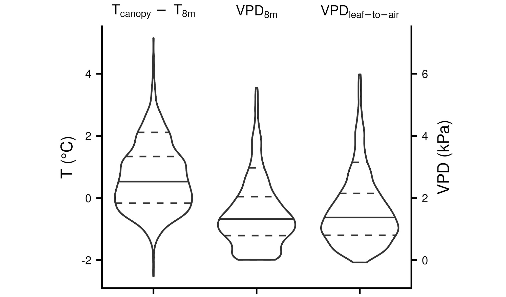

```{r, include=FALSE}
knitr::opts_chunk$set(echo = FALSE,
                      warning = FALSE,
                      tidy = FALSE,
                      message = FALSE,
                      fig.align = 'center',
                      out.width = "100%")
options(knitr.table.format = "html") 

#knitr::write_bib(c('posterdown', 'rmarkdown','pagedown'), 'packages.bib')
```

# Introduction

A travers cette étude, nous souhaitons mettre en évidence comment la mesure de la température de surface foliaire ($T_f$) nous permet d' améliorer notre compréhension des interactions ecosystème-atmosphère. $T_f$ est une des variables sur lesquels les biologistes ont déployé beaucoup d'effort avec des méthodes souvent intrusives. Le déploiement de caméras thermiques semble être une piste prometteuse du fait de la non intrusivité et de la fiabilité du capteur. Pour autant peu d'études ont cherchées à mesurer sur des périodes "longues" la température de surface: @bowlingLimitationsWinterSpring2018, @kimCanopySkinTemperature2016 sans perturber l'environnement des feuilles (aiguilles dans notre cas) de mesure la température de surface de ces organes.

# Objectifs

1. Déployer et valider un dispositif de mesure de la température foliaire sur le long terme
3. utiliser une équation de flux pour estimer la conductance stomatique
4. Comparer cette estimation à d'autres méthodse plus classiques. 

# Site d'étude

Site ICOS de classe 2 installé au sein d'une pinède de 15 ans au sud Ouest de Bordeaux. En 2020 la densité des arbres était de $991 ~arbres~ha^{-1}$ avec une hauteur, un DBH et un LAI moyen respectivement de 9.43 m, 0.145 m et 1.6.

```{r, site-scheme, fig.cap = "Schéma du site expérimental. En violet les capteurs ICOS et en rouge les capteurs spécfiques à mon étude.", fig.height=3,fig.width=1}
knitr::include_graphics("poster_INSU_files/Bilos_general2.png")
```
\
\
\
\
\

# Température foliaire
traitement et validation:

- sélection de régions d'intérêts 
- appliquation des corrections dues:
    - à l'atmosphère - T, RH
    - à l'objet: emissivité - taille du pixel
    - au boîtier de la caméra - $T_{vitre}$, $T_{boîtier}$
- validation avec une cible de référence. 
    
Utilisation extensive du package Thermimage [@tattersallThermimageThermalImage2019]

```{r, ROIS, fig.cap = "Surface temperature acquired with the TIR camera (sc655sc, FLIR Systems, USA). Image taken the 30th of July at 15H12 (UTC)."}
knitr::include_graphics("poster_INSU_files/ROIS_resized.jpeg")
```

```{r, Ts-distri,fig.cap = "temperature difference and VPD distribution over the 2020 summer."}

```
Pour la pinède étudiée, un très faible découplage thermique a été observé (0.3 K en moyenne) et des extremums d'écarts de températures allant de -2 à 5 K . De tels résultats ont été trouvé pour des peuplements similaires au pin maritime qui tendent à maximiser le couplage aérodynamique: *pinus halepensis* [@mullerEvidenceEfficientNonevaporative2021].

# comparaison de méthodes de conductances stomatiques

|Méthodes|équation|abbrv-couleur|
|--|--|--|
|Penman-Monteith |$\mathrm{g_s} = \frac{ \lambda \cdot E \cdot g_a \cdot \gamma}{\Delta \cdot A + \rho \cdot c_p \cdot VPD - \lambda \cdot E \cdot (\Delta + \gamma) }$|PMT - violet|
|équations de flux "simplifié"|$\mathrm{g_s} = \frac{K(T_{air}) \cdot E}{VPD}$|GT' - orange|
|équations de flux |$\mathrm{g_w} = \frac{P \cdot E}{0.662 \cdot \rho \cdot (e_s(T_{f})- e_a)}$|GT - vert|

```{r, daily_gs, fig.cap="Cinétiques journalières de la conductance stomatique pour l'été 2020."}
knitr::include_graphics("poster_INSU_files/figure_daily_gs.jpeg")
```

# Conclusions
- Faible découplage thermique du à un couplage atmosphérique fort 
- bonne adéquation entre les différentes méthodes de $g_s$
- différences les plus fortes lorsqu'il y a des stress faibles/moyens. 
# remerciements ? 

# References
